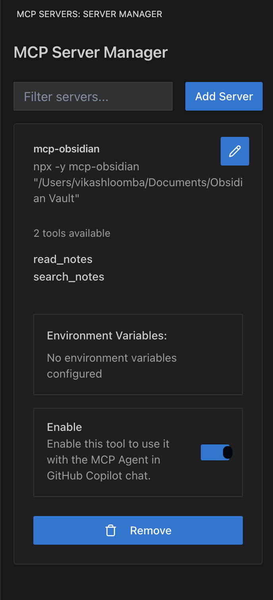
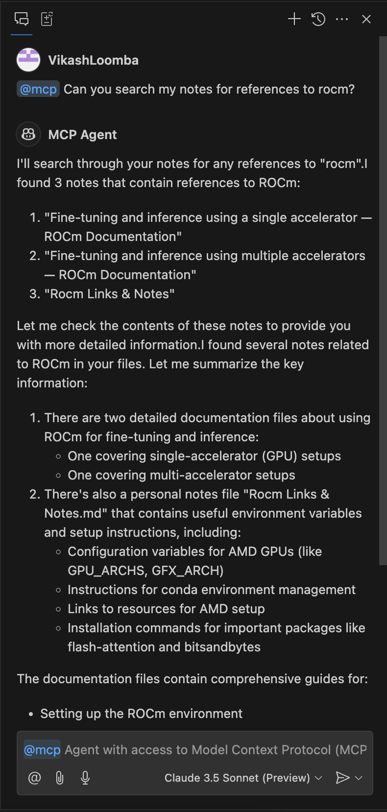

# Copilot MCP Client for VSCode

<div align="center">


<div style="display: flex; justify-content: center; gap: 20px; margin: 20px 0;">
  
  
</div>


[](https://www.gnu.org/licenses/gpl-3.0)
[](https://code.visualstudio.com/api/references/extension-guidelines)
[](https://modelcontextprotocol.io/clients)

</div>

> A powerful VSCode extension that acts as a Model Context Protocol (MCP) client, enabling seamless integration between MCP tool servers and GitHub Copilot Chat. Join the growing ecosystem of interoperable AI applications with flexible integration options.

## ✨ Features

- 🔧 **MCP Server Management**: Connect and manage multiple MCP servers through an intuitive UI
- 🚀 **Copilot Integration**: Expose MCP tools directly to GitHub Copilot Chat participants
- 🎯 **Tool Discovery**: Automatically discover and surface available tools from connected MCP servers
- ⚡ **Server Health Monitoring**: Real-time monitoring of MCP server status and connections
- 🔄 **Automatic Connection Management**: Seamless handling of MCP server connections and reconnections
- 🛠️ **Tool Invocation Support**: Full support for MCP tool invocation through Copilot Chat

## 🎯 MCP Feature Support

| Feature | Support |
|---------|----------|
| Tools | ✅ Full support |
| Resources | ✅* Full support (coming soon) |
| Prompts | ✅* Full support (coming soon) |
| Sampling | ⏳ Planned |
| Roots | ⏳ Planned |

## 📦 Installation

1. Install the extension from the VSCode Marketplace
2. Configure your MCP servers through the extension settings
3. Start using GitHub Copilot Chat with your MCP tools!

## 🛠️ Configuration

You can configure your MCP servers in the UI or in VSCode settings.

In the UI, look for the "MCP Servers" button in the activity bar.

To configure your MCP servers in VSCode settings:

```json
{
  "mcpManager.servers": [
    {
      "id": "unique-server-id",
      "name": "My MCP Server",
      "command": "start-server-command",
      "enabled": true
    }
  ]
}
```

### Server Configuration Properties

| Property | Type | Description |
|----------|------|-------------|
| `id` | string | Unique identifier for the server |
| `name` | string | Display name for the server |
| `command` | string | Command to start the server |
| `enabled` | boolean | Whether the server is enabled |

## 🚀 Usage

1. Open the MCP Servers view from the VSCode activity bar
2. Add and configure your MCP servers
3. Enable/disable servers as needed
4. Use GitHub Copilot Chat with your connected MCP tools using the `@mcp` participant
5. View server status and tool availability in real-time

## 🔗 Requirements

- VSCode 
- GitHub Copilot Chat extension
- Compatible MCP servers (see [Example Servers](https://modelcontextprotocol.io/servers))

## 🌟 Benefits

- Enable Copilot to use custom context and tools through MCP
- Join the growing ecosystem of interoperable AI applications
- Support local-first AI workflows
- Flexible integration options for your development workflow

## 👥 Contributing

Contributions, issues and feature requests are welcome!
Feel free to check the [issues page](https://github.com/yourusername/copilot-mcp/issues).

## ✍️ Author

**Vikash Loomba**

* Website: https://automatalabs.io
* Github: [@vikashloomba](https://github.com/vikashloomba)

## 📝 License

Copyright © 2024 [Vikash Loomba](https://automatalabs.io).

This project is licensed under the [GNU General Public License v3.0](LICENSE).

---

_Part of the [MCP Client Ecosystem](https://modelcontextprotocol.io/clients) - Enabling interoperable AI tools for developers_ ⭐️
